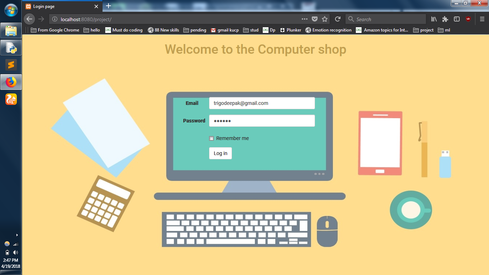
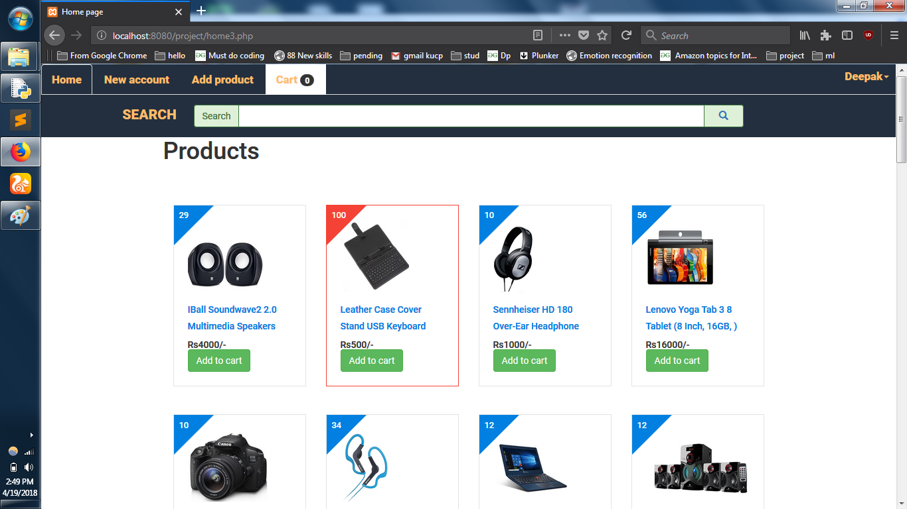
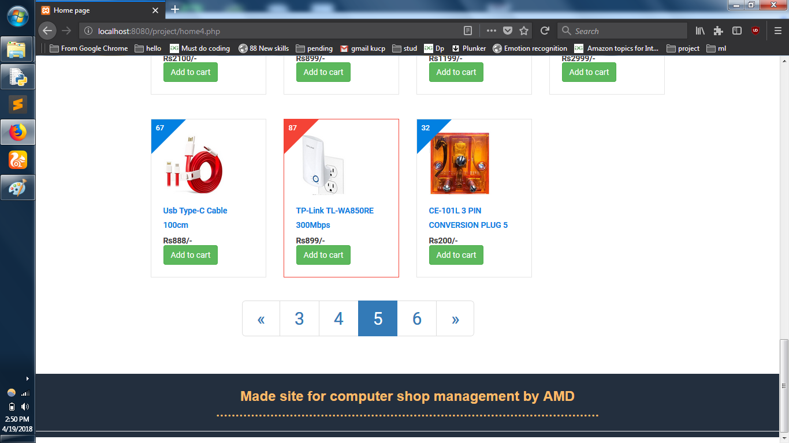
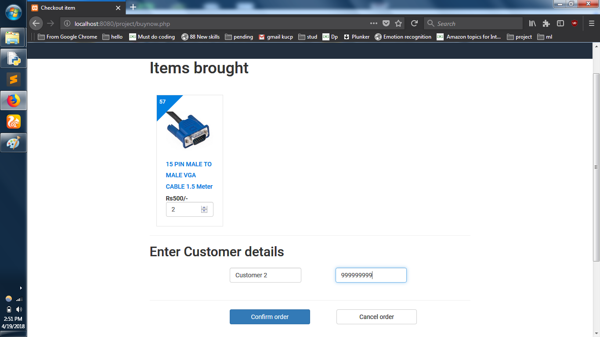
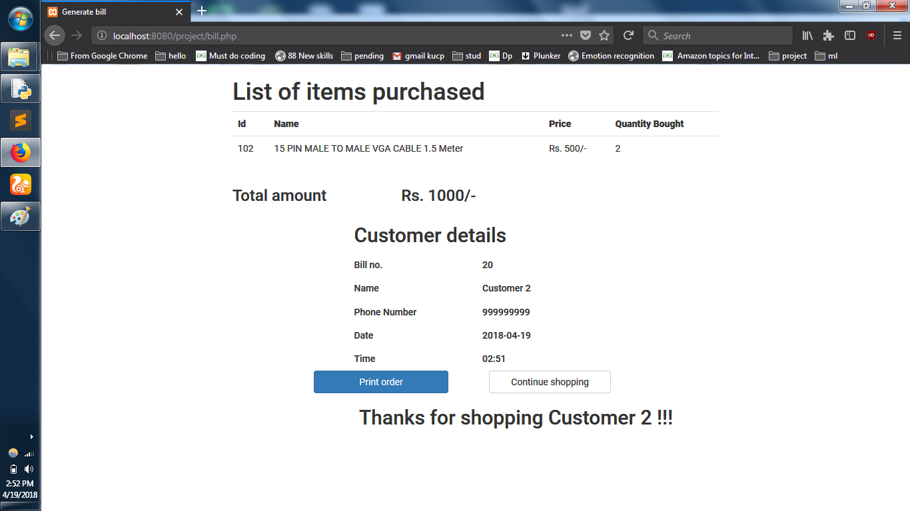

# Computer-Shop-management
Made an Inventory system for a computer hardware store. The project is developed using php, bootstrap, js ,sql.
Here are screenshots for the same.
1.Login Page

2.Home Page and search bar

3.Home Page bottom

4.Customer Cart

5.Generate Bill
